# Merlin: Network Magic 
A Django implementation of Merlin


Powered by 


Build using 


REST API provided by 


Scheduling coordinated by


And


Featuring presentation enhancements with 


# Considerations for current Alpha build

* Please note - these instructions are currently to install all of the required packages, clone the repository, and start a pre-packaged database and server. 

* In the near future this project will move to a Docker container in hopes of eliminating these manual steps 

* In the interest of agility and accessibility and due to demand I've decided to make a working README for the project in it's current Alpha state so others can start to use the tool 

* The project has ** only ** been tested against a single device and has not taken scale into conideration at this point yet - once I scale out and confirm 1+n devices work this bullet point will be removed

# Install Guide 
These instructions are for Windows 10 using WSL2 + Ubuntu 

## Create a virtual environment 

```console

$ virtualenv merlin

$ source merlin/bin/activate 

```

## Install Required Packages

### Django:

```console

(merlin)$ pip install django

```

### Django REST Framework

```console

(merlin)$ pip install djangorestframework

```

### PostgreSQL

```console

(merlin)$ pip install psycopg2-binary

(merlin)$ pip install postgres 

```

### Celery

```console

(merlin)$ pip install -U Celery

(merlin)$ pip install django-celery-beat

```

### Redis

```console

(merlin)$ wget http://download.redis.io/redis-stable.tar.gz  

(merlin)$ tar xzf redis-stable.tar.gz  

(merlin)$ cd redis-stable  

(merlin)$ sudo make install

(merlin)$ pip install redis

```

### pyATS

To Avoid this error

```console

ERROR: aiohttp-swagger 1.0.15 has requirement markupsafe~=1.1.1, but you'll have markupsafe 2.0.1 which is incompatible

```

### First remove markupsafe

```console

(merlin)$ pip uninstall --yes markupsafe

(merlin)$ pip install markupsafe==1.1.1

```

### Then proceed with pyATS Full Installation

```console

(merlin)$ pip install pyats[full]

```

### Clone the repository

```console

(merlin)$ git clone https://github.com/automateyournetwork/merlin_unchained.git

```

### Start everything up

```console

## get into the application folder
(merlin)$ cd merlin_unchained/merlin/merlin

## setup your environment variable
(merlin)$ export DJANGO_SETTINGS_MODULE=merlin.settings

## start postgresql server - you need to do this everytime you close down your virtual environment and restart your virutal environment 

(merlin)$ sudo service postgresql restart

## migrate the database (one time / first time post installation steps only)
(merlin)$ python manage.py makemigrations merlin

(merlin)$ python manage.py migrate merlin

## (optional) start the redis server if you are running periodic tasks
(merlin)$ redis-server --daemonize yes  

## (optional) confirm redis is up 
(merlin)$ redis-cli ping

## start the Merlin Django server 
(merlin)$ python manage.py runserver

```

## Subsequent startup 

After this first time installation is complete you only need to ensure the PostgreSQL, Django, and, optionally for periodic tasks, Redit are running 

```console

(merlin)$ sudo service postgresql restart

(optionally) (merlin)$ redis-server --daemonize yes  

(merlin)$ python manage.py runserver

```

## Successful Installation and Healthy Merlin Service 

If your above installation was a success and you started both the PostgreSQL server and the Django server you should have a server now on your localhost listening on port 8000

```console

$ python manage.py runserver

Watching for file changes with StatReloader
Performing system checks...

System check identified no issues (0 silenced).
September 27, 2021 - 14:18:19
Django version 3.2.7, using settings 'merlin.settings'

Starting development server at http://127.0.0.1:8000/
Quit the server with CONTROL-C.

```

# Log In - Admin Panel 

You should now be able to visit http://localhost:8000/admin 

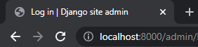

Where you will be presented with a login 

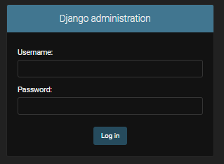

## Default Username and Password:

admin

admin

You can change this default password as well as add your own users and groups via the admin panel 

## Tables 

Each pyATS function - learn config, parse show ip interface brief, learn platform, etc - are all mapped to indivudal database tables 

As an administrator you can perform <b>Create Read Update Delete (CRUD)</b> operations directly from the administrator panel 

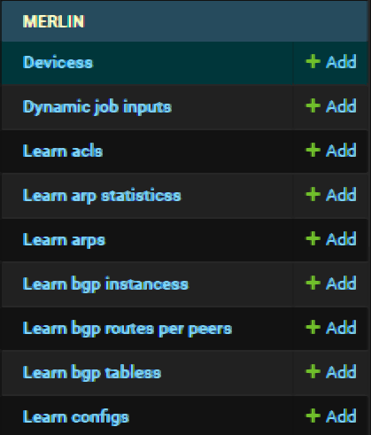

## Default Dataset 

This utility is currently being built using the Cisco DevNet Sandbox - Nexus 9000

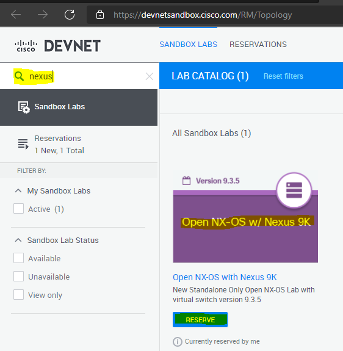

I have included a single record set per table for demonstration from the Cisco DevNet Sandbox - Nexus 9000 

In order to be <b>YAML FREE</b> we convert a traiditonal "testbed.yaml" file into a database Model and Table 

Traditional pyATS solutions typically would include a file like

testbed_DevNet_Nexus9k_Sandbox.yaml

That would look like this:

```yaml

devices:
    sbx-n9kv:
      alias: 'DevNet_Sandbox_Nexus9k'
      type: Nexus 9000
      os: 'nxos'
      credentials:
        default:
          username: admin
          password: Cisco123
      connections:        
        cli:
          protocol: ssh
          ip: 10.10.20.58
          port: 22
          arguments:
            connection_timeout: 360

```

Merlin has transformed this into a database table via a Django Model which allows us to be <b>YAML FREE!</b>

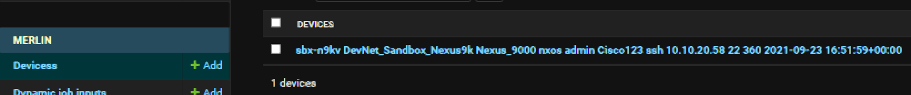

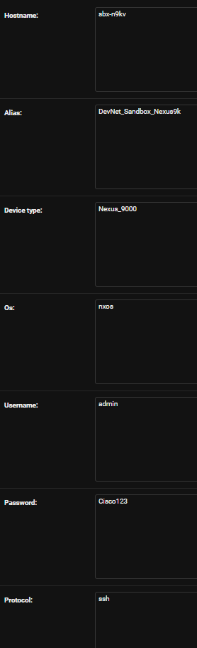

Again, this alpha has been tested on a Nexus 9000, should you choose to try this on your own (hopefully) LAB equipment 

* Delete this device from the database

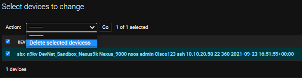

* Add a new device 

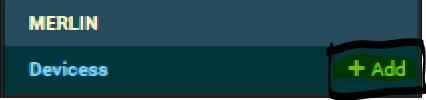

Populate the following fields:

* Hostname - (required) The *actual* hostname of the device
* Alias - (required) A friendly name for the device
* Type - (optional) Platform type friendly name (ie - Nexus 9000)
* OS - (required) Either 'nxos', 'ios', or 'iosxe'
* Username - (required) A valid username
* Password - (required) A valid password
* Protocol - (required) Typically 'ssh'; could be 'telnet'
* IP - (required) A valid IP address (ie - 10.10.20.58)
* Port - (required) Typically '22'
* Connection Timeout - (optional) Typically 360 seconds

Again, you can populate multiple devices and mix operating systems, but in this Alpha scale (1+n devices) and non-NXOS platforms (IOS, IOS-XE), have NOT been tested, will NOT be supported, but will eventually become part of Merlin. Your mileage may vary.

## Scheduling Merlin 

In the Admin Panel, using the Django Celery Beat package, you can setup periodic scheduled hands-free Merlin.

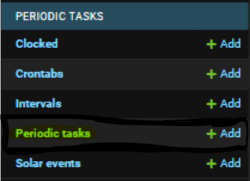

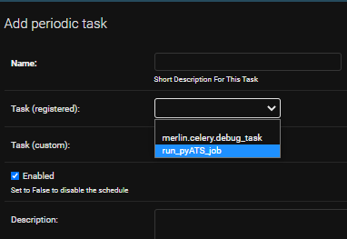

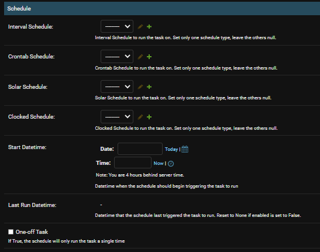

### Scheduling Notes

* It is recommended to use the Scheduler in the Admin panel, however, to manually start a 5 minute full state capture run the 2 following lines at the CLI: 

```console

(merlin)$ celery -A merlin beat -l info --logfile=celery.beat.log --detach  

(merlin)$ celery -A merlin worker -l info --logfile=celery.log --detach

```

* To stop manually scheduled period tasks:
```console

(merlin)$ pkill -f "celery worker"  

(merlin)$ kill -9 $(ps aux | grep celery | grep -v grep | awk '{print $2}' | tr '\n'  ' ') > /dev/null 2>&1

```
# pyATS Command Coverage

As of this build the following pyATS functions have been transformed into Merlin:

* Learn ACL 

* Learn ARP

* Learn ARP Statistics 

* Learn BGP Instances

* Learn BGP Routes

* Learn BGP Tables

* Learn Config

* Learn Interface

* Learn Platform

* Learn Platform Slots

* Learn Platform Virtual Devices

* Learn VLAN 

* Learn VRF

* Show Inventory

* Show IP Interface Brief

* Show Version 

# On-Demand Centre

## https://localhost:8000/OnDemand/

Merlin allows users to capture either the full network state or individual functions using the On-Demand Centre.

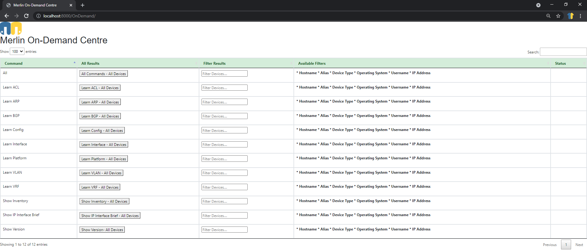

Users can press the button will capture the requested records for all devices in the database 

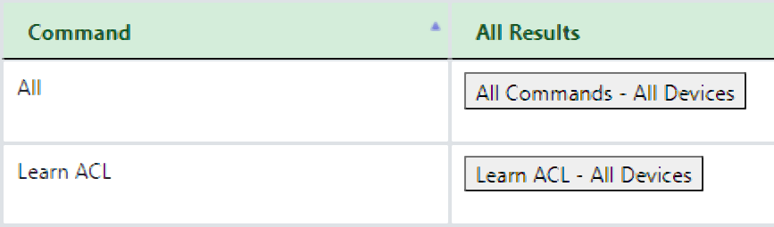

Users can also filter the scope of the pyATS job at a group level using <b>Device Type</b>, <b>Operating System</b> or <b>Username</b>; or at an individual device level using <b>Hostname</b>, <b>Alias</b>, or <b>IP Address</b>

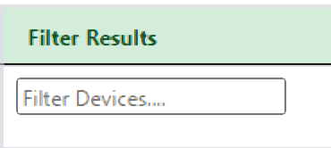

While the pyATS job collects and transforms the network state a spinner will be displayed in the Status field

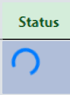

# Search Engine

## https://localhost:8000/Search/

The Merlin Search Engine allows users to keyword search against the database.

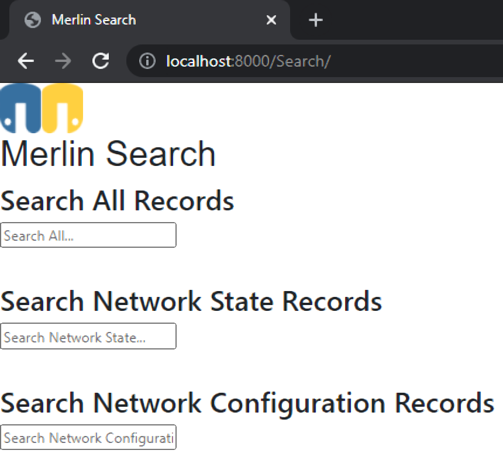

Search All Records will search both Network State and Network Configuration tables. Using this search will return the 'full' JSON of a running-config if the search hits against the Learn Configuration table. 

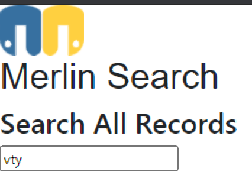

This search omits Learn Config and only searches the "State" of the network 

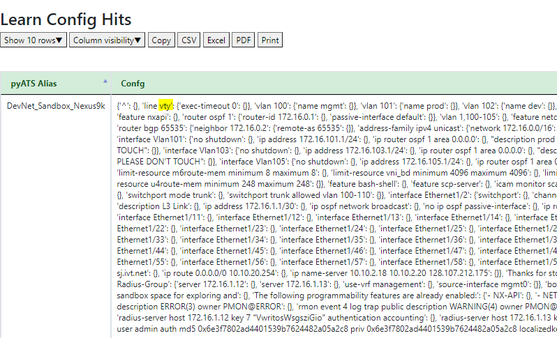

This search only looks up Learn Config and, different from the All Records Search, will break down any hits in a Configuration to each individual key, value pair found. 

Using the same "vty" example:


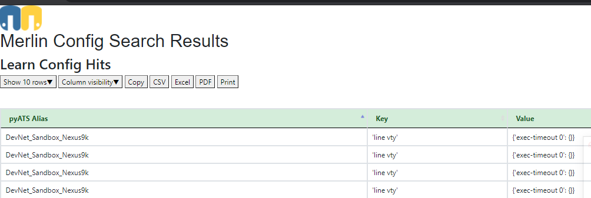

# Network State Change Centre

## http://localhost:8000/Changes/

The Merlin Network State Change Centre can detect changes in the network state or configuration by gathering the latest state from the network and comparing it against the previous latest record set in the database. 

Much like the On-Demand Centre users can press a button to compare against all devices in the database or they can use keyword filtering at a group or host level to scope the network state capture against specific devices. 

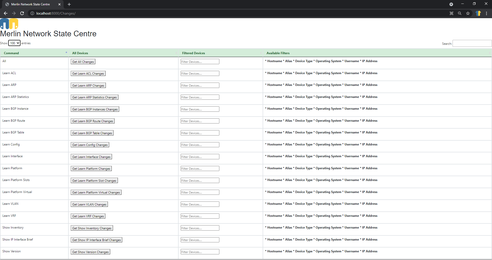
### No Changes Detected 

If Merlin does not detect any changes in network state or configuration it will tell you! 

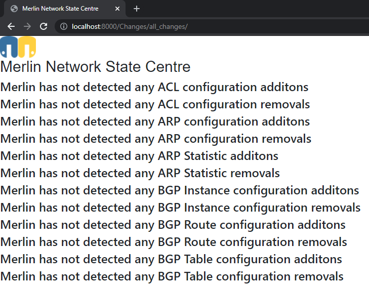

### Additions Found

If Merlin detects additions - that is to say, state or configuration <b>found</b> in the network but <b>not found</b> in the database - you will be notified of these additions

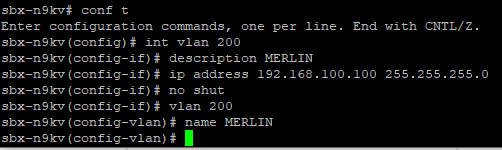

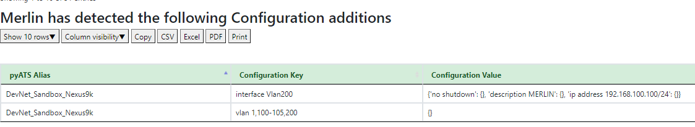

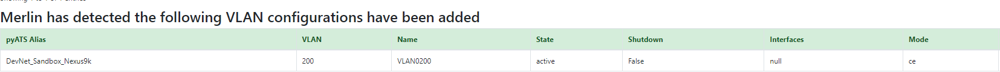

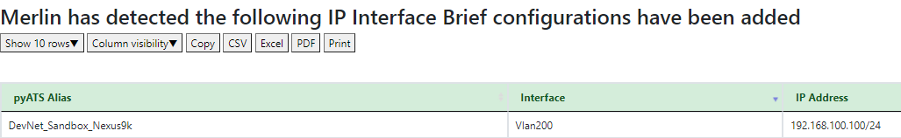


## Removals Found

If Merlin detects removals - that is to say, state or configuration <b>not found</b> in the network but <b>found</b> in the database - you will be notified of these removals 

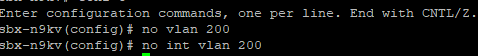


# REST API

## http://localhost:8000/API/

Merlin contains a fully functional, stand-alone REST API ! 

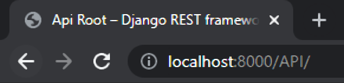

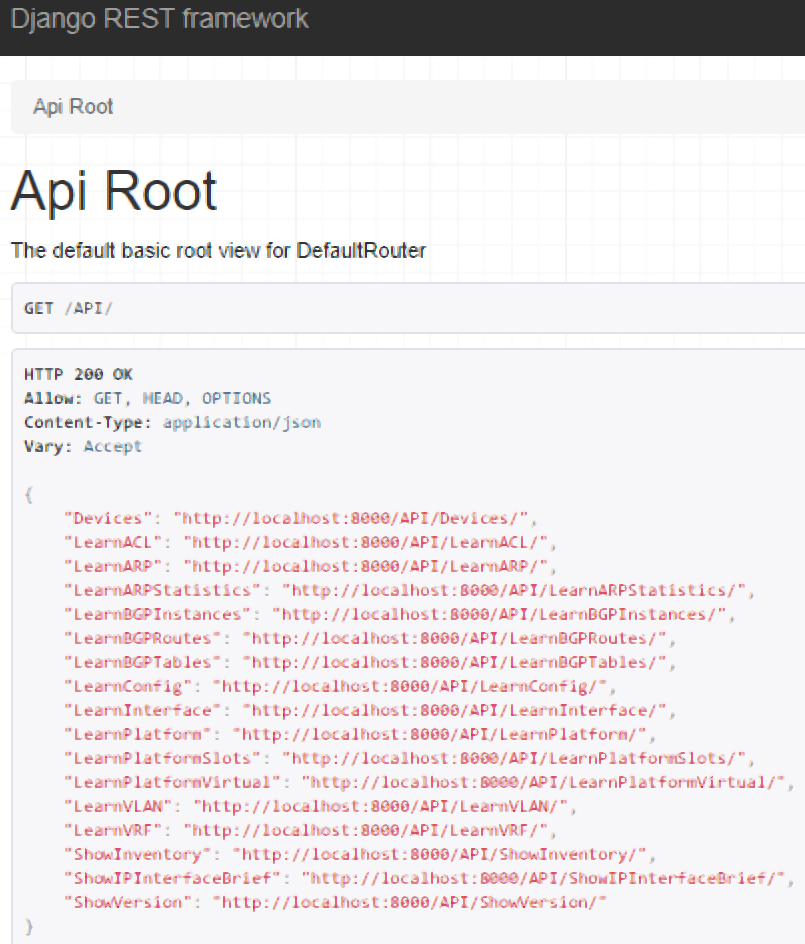

As you can see - <b>each</b> pyATS function has it's own dedicated REST API

http://localhost:8000/API/LearnConfig/

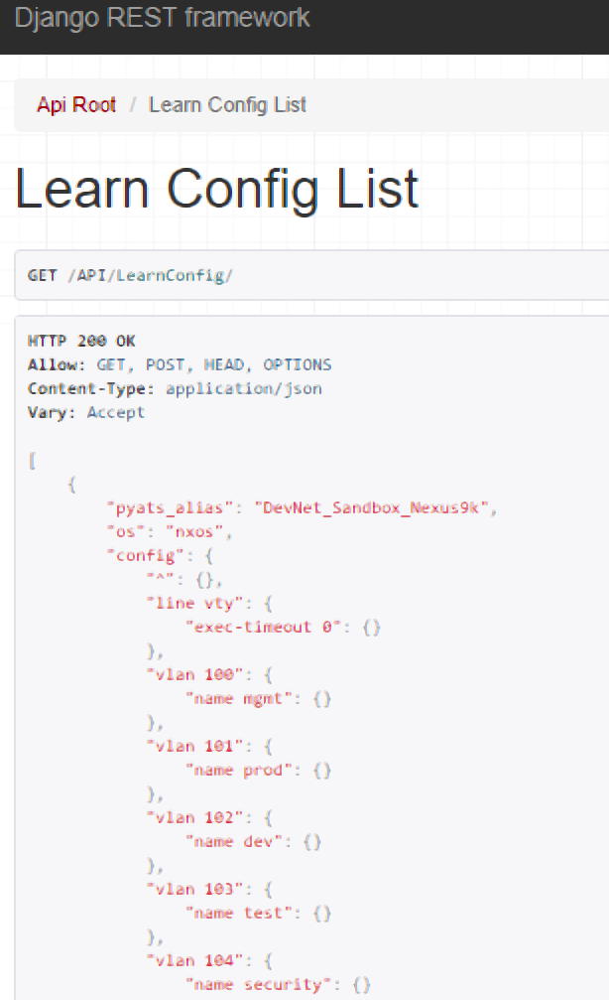

## cURL, Postman, Python 

Provided Merlin is running you can automate and program against the REST API ! 

Without ever even launching your browser you can use other tools to access the REST API 

### cURL

```console

curl http://localhost:8000/API/LearnConfig/

```

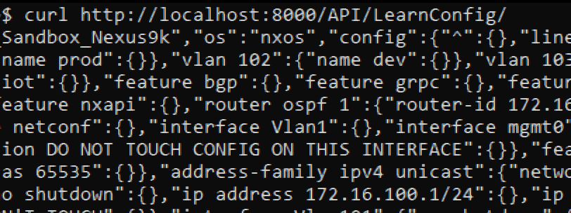

### Postman

Popular API tools like Postman can also be used!

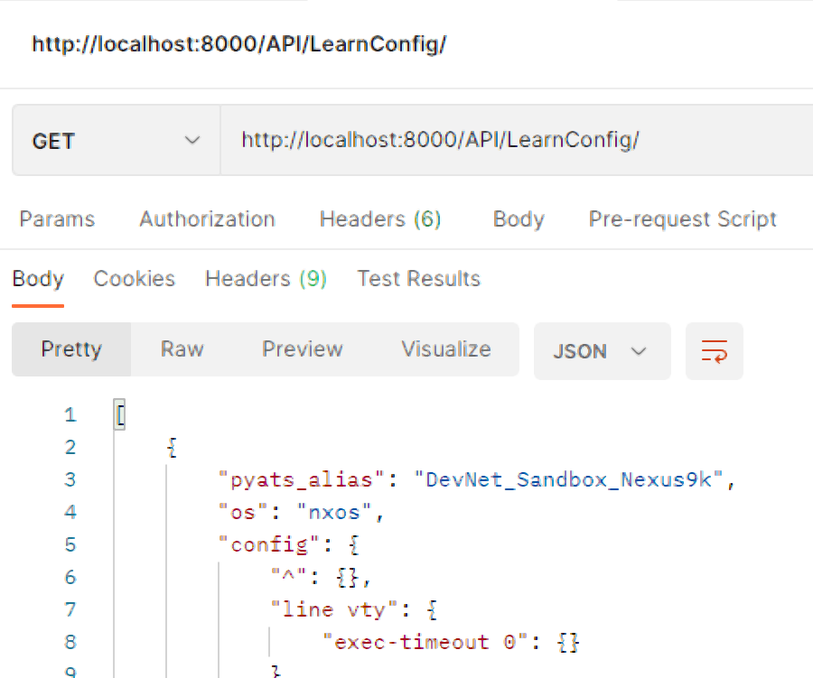

### Python

Pythonically you can use the <b>requests</b> library 

```console

$ source merlin/bin/activate 
(merlin)$ python

```

```python

# import requests
>>> Import requests

# GET Learn Config Tables

>>> learn_config = requests.get("http://localhost:8000/API/LearnConfig")

# Validate response
>>> config
<Response [200]>

# Dump content of API to screen
>>> config.content

```

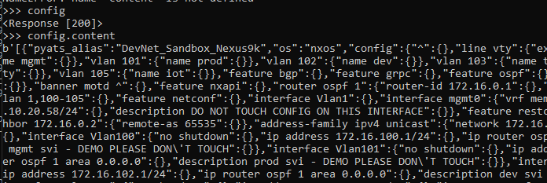

## Triggering Automation with the API 

It should be noted that all of the pyATS automation behind "the buttons" and filters can be triggered with REST API GET requests against the appropriate URL / API 

For example if you want to repopulate the entire database with fresh network state and configuration you could do a GET against

http://localhost:8000/OnDemand/GetAll/get_all_all_result/

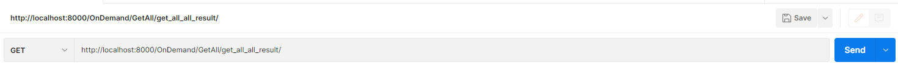

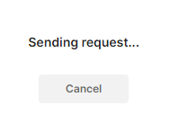

Once the pyATS job completes Postman will return the following success confirming the database has been refreshed with new network state. 

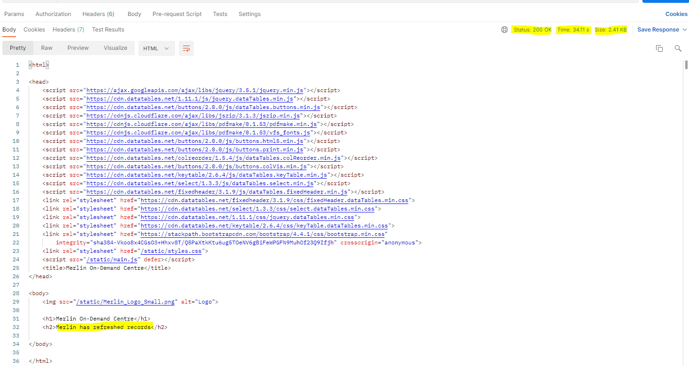

# Business Ready Document Centre

## http://localhost:8000/CSV/

At the heart of Merlin is the ability to provide network state and configuration information in Business Ready Documents - Spreadsheets ! 

Either download All Records or only the Latest Records with the click of a button! 

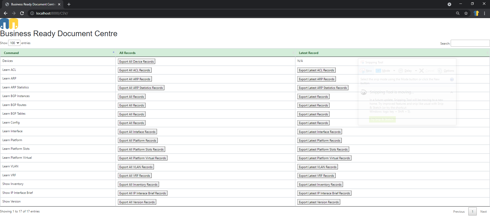

All Records

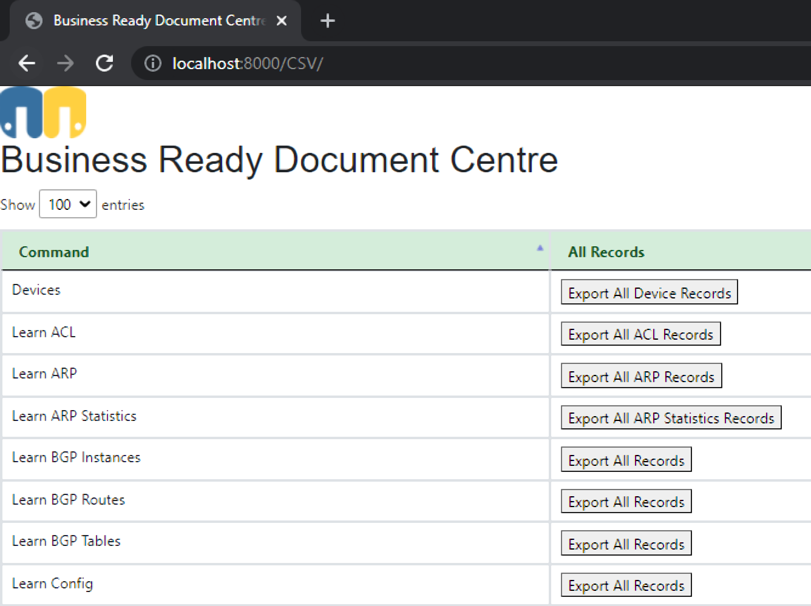

Latest Records

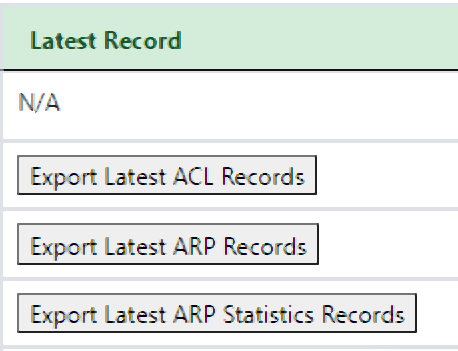

These CSV files will be in your default browser Download location and can be opened with Excel, VS Code with Excel Preview, or any CSV-viewer 
# Latest Records

## http://localhost:8000/Latest/

Often users may want only the latest records - the so-called "current" state - of the database and ideally the network state and running-configuration

Users can visit any /Latest/{{ any function }} to get the Latest records. 

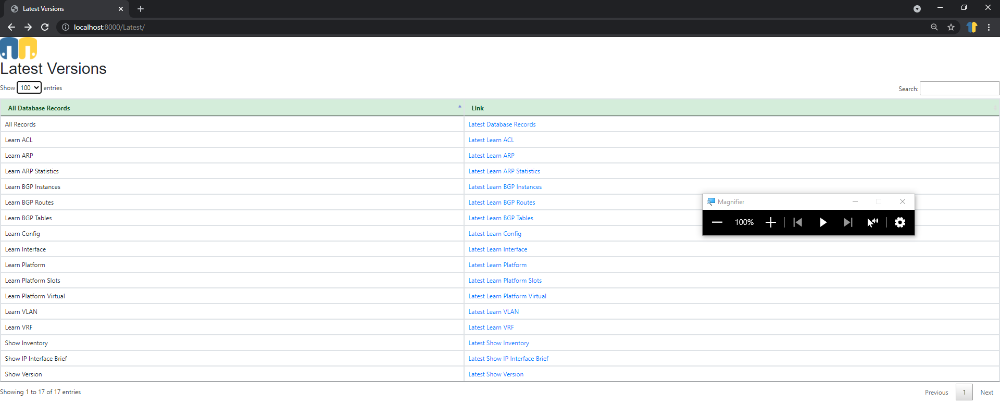

For example 

http://localhost:8000/Latest/LearnConfig/

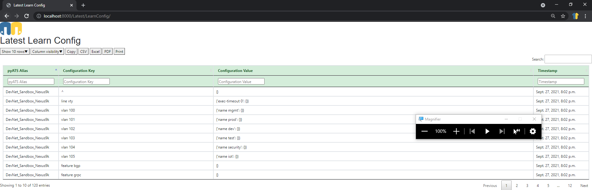

# Natural HTML Filtering 

Merlin URLs provide natural filtering for users 

Each function - for example http://localhost:8000/LearnConfig/ can be followed by the following natural filters against the database records 

## All

All records in a specific database table

http://localhost:8000/LearnConfig/All
## Year

All records in a specific database table by year

http://localhost:8000/LearnConfig/2021/ 


## Month

All records in a specific database table by year and month

http://localhost:8000/LearnConfig/2021/09

## Day

All records in a specific database table by year and month and day

http://localhost:8000/LearnConfig/2021/09/27


## Device Hostname

All records in a specific database table by hostname

http://localhost:8000/LearnConfig/Hostname/sbx-n9kv


## Device Operating System 

All records in a specific database table by operating system (so far "nxos")

http://localhost:8000/LearnConfig/OS/nxos


## Device Type

All records in a specific database table by device type (ie Nexus_9000)

http://localhost:8000/LearnConfig/Type/Nexus_9000

## Device Alias

All records in a specific database table by device Alias 

http://localhost:8000/LearnConfig/Alias/DevNet_Sandbox_Nexus9k

## Username

All records in a specific database table by configured username

http://localhost:8000/LearnConfig/Username/admin

## IP

All records in a specific database table by IP Address

http://localhost:8000/LearnConfig/IP/10.10.20.58

## Port

All records in a specific database table by port

http://localhost:8000/LearnConfig/Port/22

# How to Reach Me 

Please contact me on Twitter - https://twitter.com/john_capobianco 